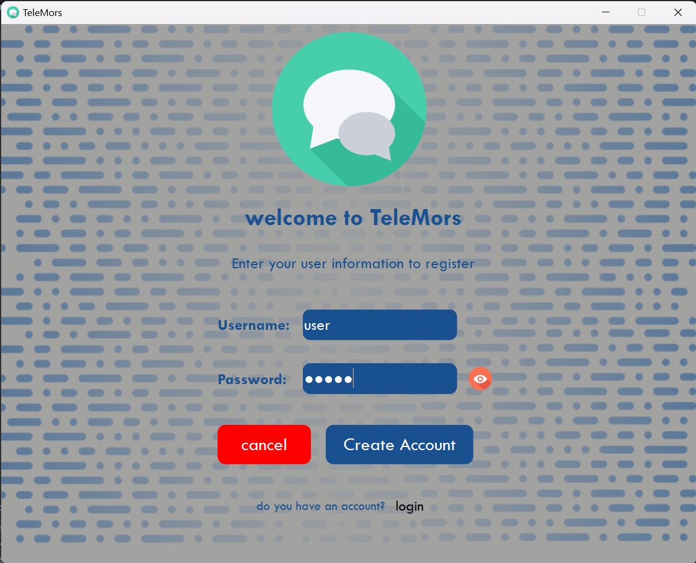
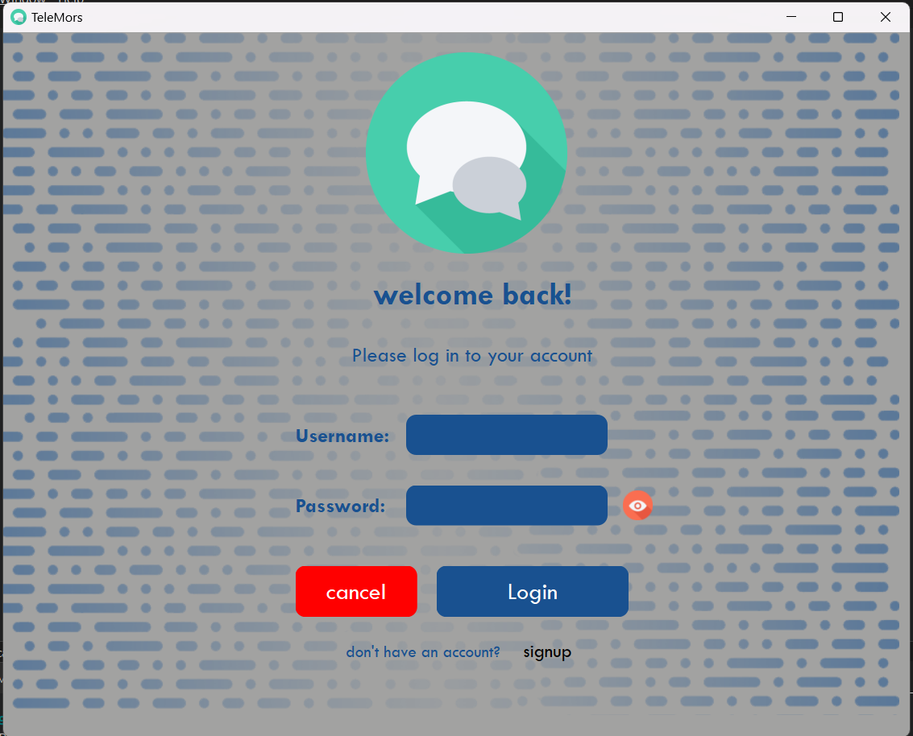
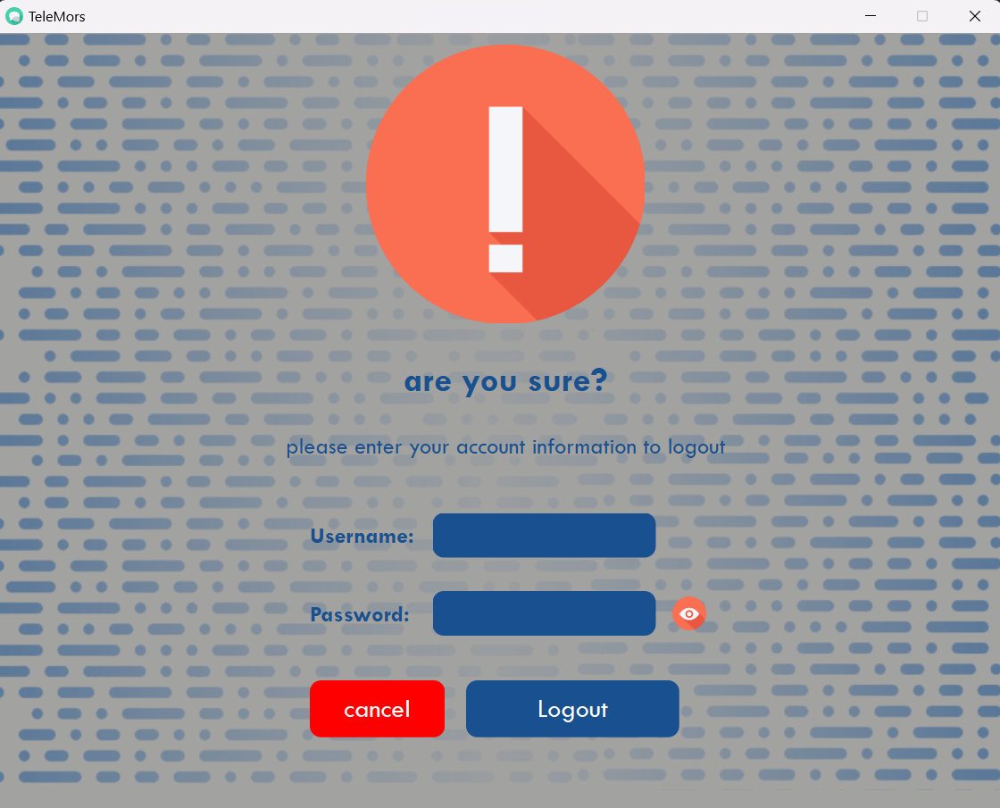
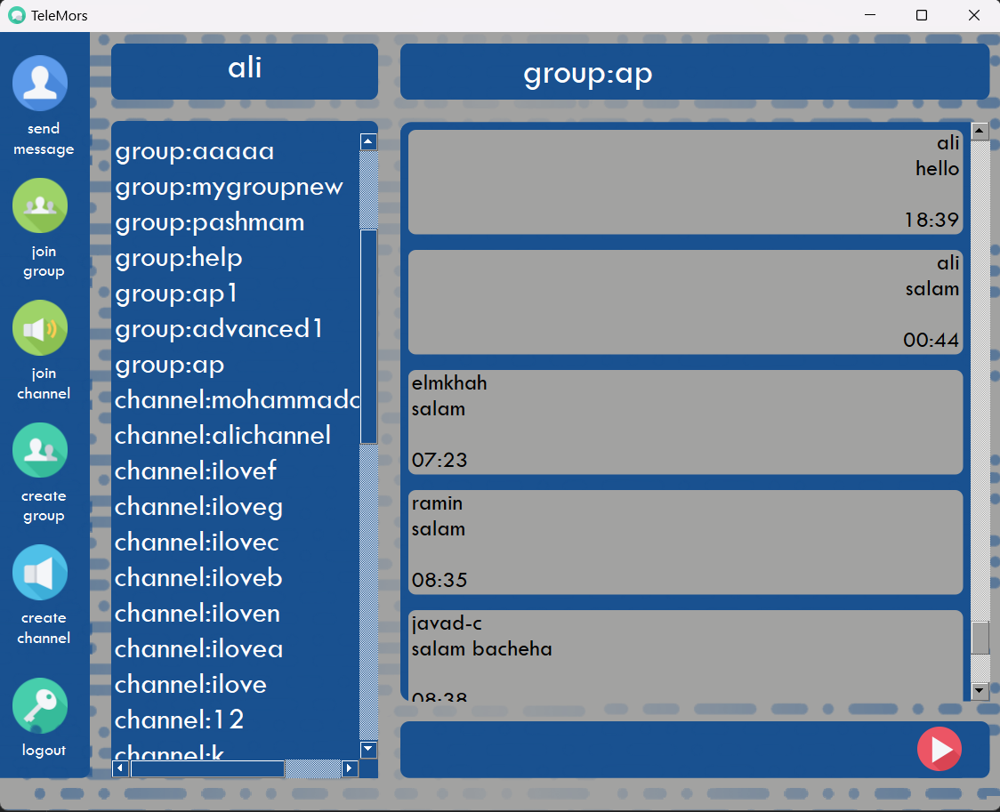
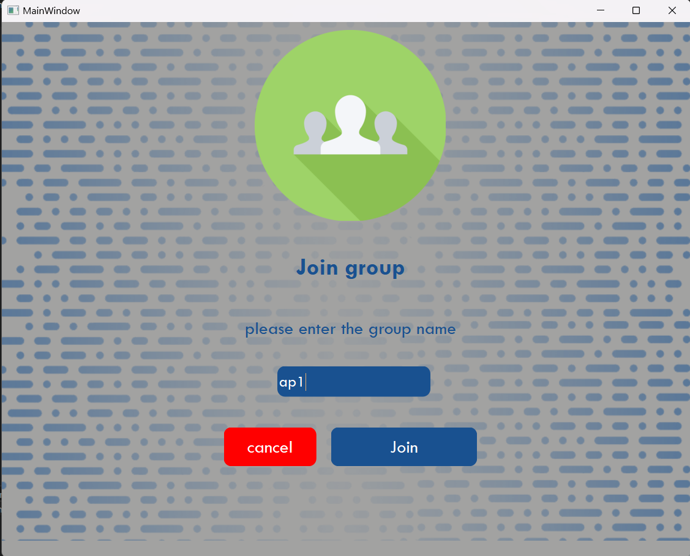
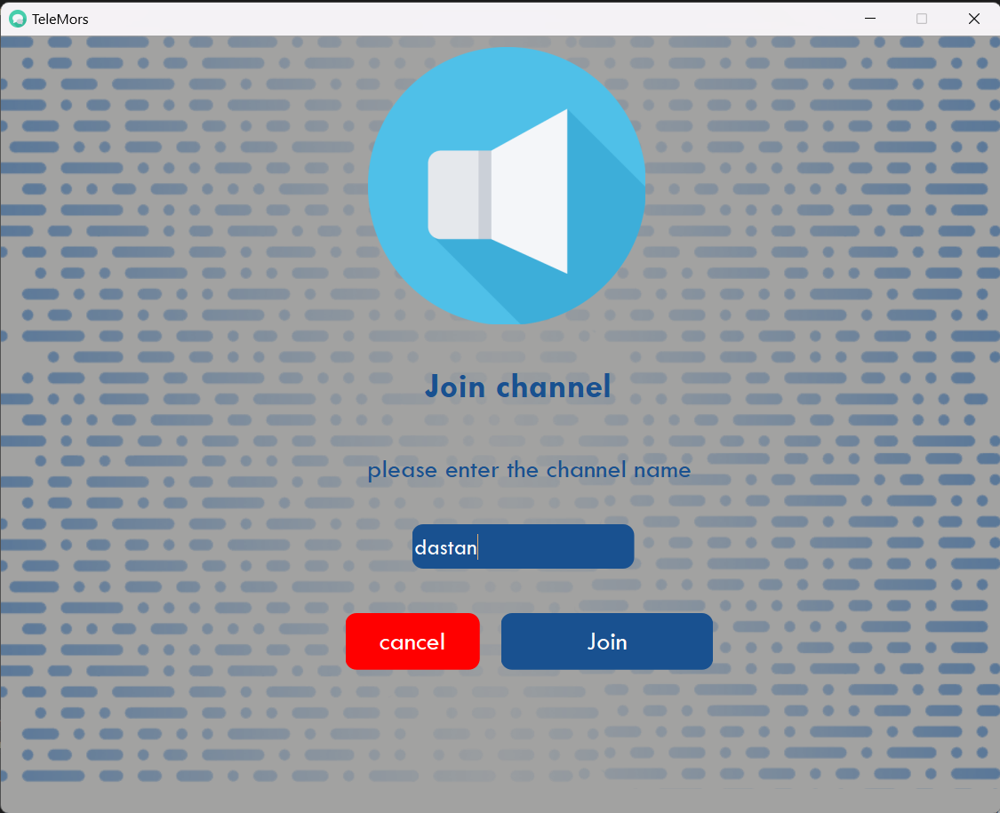
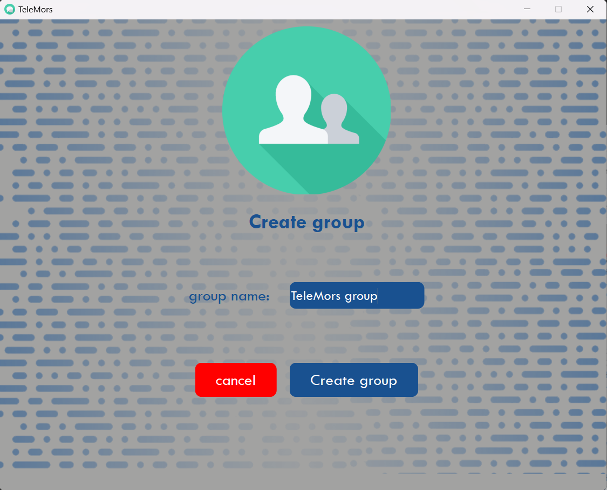
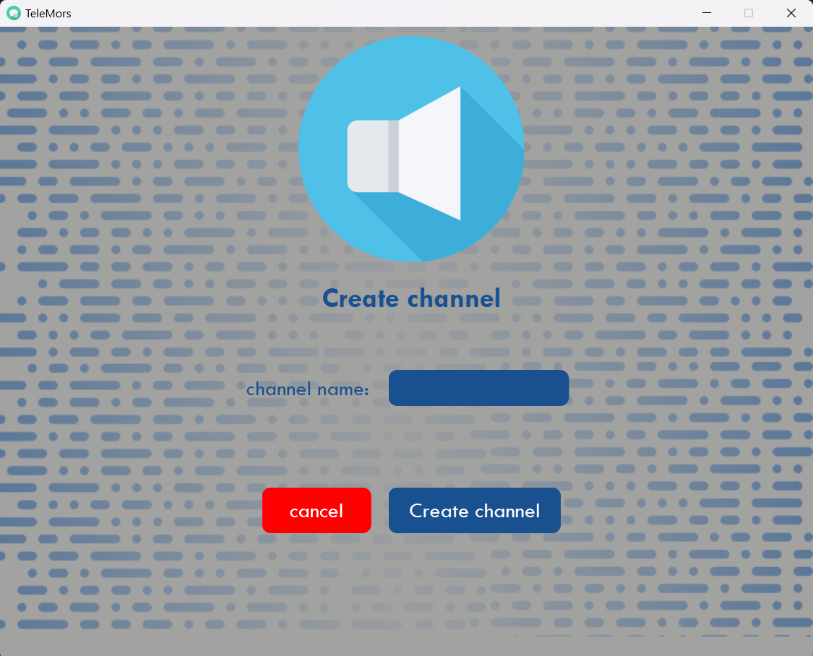
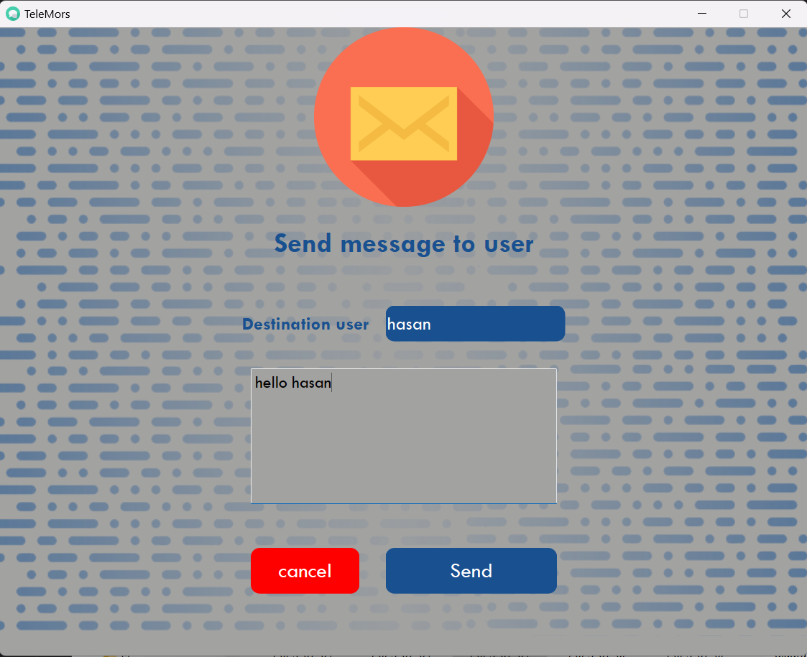

## TeleMors
Designing and programming the client side of messenger developed with QT framework.

## Installation

To run the program, you need to run the installer file (setup.exe). Then run the TeleMors.exe file from the installation directory.\
If you have not already registered in Messenger, by registering in TeleMors, the program will close automatically. You must run the program again and this time login to the program.

## Features
- Signup
- Login
- Logout
- Send messages to user,group and channels that are admin
- Receive messages from user,group and channels
- Create group
- Create channel
- Join group
- Join channel

## Dependenices

GNU GCC 6.5.1 compiler or higher

## Screenshots of the program execution

